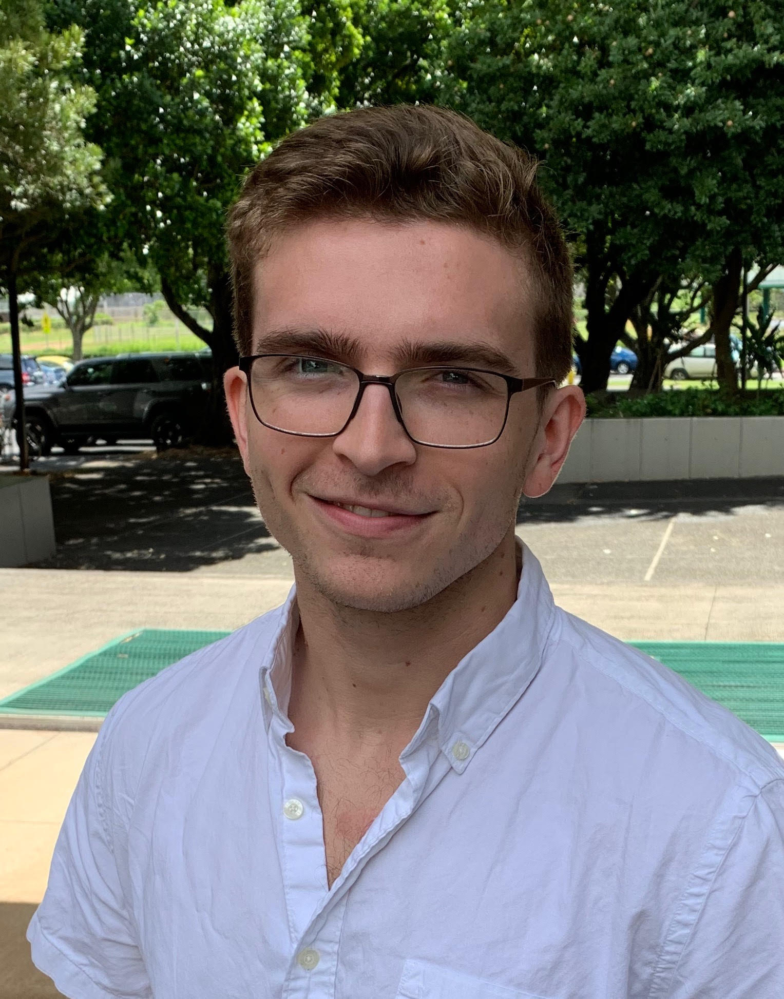

<!DOCTYPE HTML>
<!--
	Theory by TEMPLATED
	templated.co @templatedco
	Released for free under the Creative Commons Attribution 3.0 license (templated.co/license)
-->
<html>
	<head>
		<title>lukaszalesky.space</title>
		<meta charset="utf-8" />
		<meta name="viewport" content="width=device-width, initial-scale=1" />
		<link rel="stylesheet" href="assets/css/main.css" />
	</head>
	<body>

		<!-- Header -->
			<header id="header">
				

					<!-- <a href="index.html" class="logo">LMZ</a> -->
					<nav id="nav">
						<a  href="index.html" class="active_page">Home</a>
						<a  href="research.html">Research</a>
						<a  href="code_resources.html">Code/Resources</a>
						<a  href="outreach.html">Outreach</a>
						<a href="lukaszalesky_cv.pdf" > CV</a>
					</nav>
					<ul class="icons">
						<li><a href="mailto:zalesky@hawaii.edu" class="icon fa-envelope">Twitter</a></li>
						<li><a href="https://www.facebook.com/lukas.zalesky.1238" class="icon fa-facebook">Facebook</a></li>
						<li><a href="https://twitter.com/cosmos_lukas" class="icon fa-twitter">Twitter</a></li>
						
						<!-- <li><a href="#" class="icon fa-linkedin">linkedIn</a></li> -->
					</ul>
					<a href="#" class="navPanelToggle"></a>
				

			</header>

		<!-- Banner -->
			<section id="banner">
				<h1 style="color:white"> Lukas M. Zalesky: Astrophysics  </h1>
				
"Ex astris, scientia"

			</section>

		<!-- Two THIS IS THE ABOUT SECTION -->
			<section id="two" class="wrapper">
				

					<header>
						<h2>About Me
						</h2>
						
...

					</header>
					

			
						<article>
							
							<header>
								<h3> PhD Candidate | Institute for Astronomy, University of Hawaii</h3>
							</header>

							
 I am a PhD candidate at the University of Hawaii's Institute for Astronomy working in extragalactic astronomy. 
								My specialties include using multiwavelength surveys to measure and characterize the ways galaxies evolve over billions of years as well as techniques
								involving gravitational lensing. 
								 
								 
								I obtained my B.S. in Astrophysics with a minor in Mathematics from College of Charleston's Honors College where I worked under Dr. George Chartas and graduated summa cum laude. 
								My undergraduate thesis 
								focused on creating and applying new methods to measure the spins of gravitationally lensed quasars using X-ray spectroscopy. Since then I have developed a new
								code for modeling the mass distributions of massive galaxy clusters for the purpose of measuring their magnification profiles due to gravitational lensing. 
								For my dissertation, I am working under 
								Dr. David Sanders on the Hawaii Twenty Square Degree Survey (H20), an ultra-deep (AB mag &lt 27.5) optical and near-infrared survey of the primary calibration fields of the Euclid
								mission. The H20 survey will obtain the single largest sample of galaxies with stellar mass estimates from times earlier than two billion years after the Big Bang.
								 
								 
								Below I describe a few of the recent projects I have been a part of. For a more complete listing of my research projects, head over 
								to my <a href="generic.html">research</a> page and check out my <a href="https://ui.adsabs.harvard.edu/search/q=%20author%3A%22Zalesky%2C%20Lukas%22&sort=date%20desc%2C%20bibcode%20desc&p_=0">ADS history.</a>
								Publicly available code and other useful documents I have contributed to are shared on my <a href="generic.html">code/resources</a> page. At the bottom 
								of this page you'll find information about my outreach involvement, which I describe more fully on my <a href="generic.html">outreach</a> page.
							
							

						</article>
						<footer>
							<a href="lukaszalesky_cv.pdf" class="button special">Download my CV</a>
						</footer>
						

						
						
					

				

			</section>

			<!-- One -->
			<section id="one" class="wrapper">
				

					<header class="align-center">
						<h2 style="background-color:#5385c1; color:white"> 
							Recent and Ongoing Projects
						</h2>
						
						
					</header>
					

						<article>
							<header>
								
								<h3>The Hawaii Twenty Square Degree Survey </h3>
							</header>
							
 Combining ultra-deep Subaru Hyper Suprime-Cam and Spitzer Space Telescope imaging with Keck DEIMOS spectroscopy over the 
								North Ecliptic Pole and Euclid Deep Field Fornax, the Hawaii Twenty Square Degree Survey (H20) will provide the most comprehensive view of the high-redshift
								universe to date. My role in this effort includes obtaining precision photometry using new techniques and software developed by our team and 
								measuring the redshifts and physical properties of galaxies through multi-wavelength analysis of their spectral energy distributions. 
								I am also the lead team member of the H20 survey in measuring the galaxy stellar mass function at high-redshift. See our website for more information. 
						 	

							<footer>
								<a href="https://project.ifa.hawaii.edu/h20/" class="button special">H20 website</a>
								 
								 
								 
							</footer>
						</article>
						
						
						<article>
							<header>
								

								
								<h3 ALIGN="left">The Farmer Model-Based Photometry</h3>
							</header>
							

								Ultra-deep, panchromatic surveys like Hawaii Two-0 require new tools and strategies for generating astronomical source catalogs. 
								With increasing survey depth, the fraction of sources which overlap with one another likewise increases. Additionally, when considering
								faint and distant sources (like those targeted by many upcoming, high-redshift focused surveys), robust photometry is paramount and statistical 
								reliability of such measurements is required. 
								With this in mind, we have developed The Farmer, a flexible pythonic wrapper of the profile-fitting software The Tractor (Lang & Hogg 2016), 
								which enables superior photometric deblending and statistical insight into the properties measured during source extraction.
								The Farmer is designed to handle all of the requirements of a full-scale photometry pipeline, from source detection, model-fitting and forced photometry,
								through final catalog creation.
								See more in our paper, or check out the <a href="generic.html">code/resources</a> page for access to the code and documentation.
							

							<footer>
								<a href="#" class="button special">Paper in prep.</a>
								 
								 
								 
							</footer>
						
						</article>

						<article>
							<header>
								

								
								<h3>AStroLens: Automatic Strong-Lens Modeling</h3>
							</header>
							
							

								In the past decade, numerous software packages have been written to model the mass distributions within galaxy clusters, providing measurements
								of their gravitational lensing ability and predictions of the locations and magnifications of strongly-lensed images. Many of these codes 
								require substantial prior information about the lensing system in the form of numerous spectroscopic redshifts of lensed sources in order to
								build a quality lens model. But what if you don't have that prior information? For situations like these, I have written the code AStroLens, 
								which requires only the photometric and geometric information of cluster galaxies to build a lens model and no other information. 
								AStroLens uses parameters tuned on known lensing clusters to rapidly build models, enabling immediate insight to the magnification 
								abilities of massive clusters. This code has been validated in two publications, and will soon become publicly available
								through my <a href="generic.html">code/resources</a> page. 
							

							<footer>
								<a href="https://arxiv.org/abs/2007.12182" class="button special">Paper 1</a>
								 
								 
								 
							</footer>
						</article>
						
						<!-- <article>
							<header>
								<h3>Next or Current Project</h3>
							</header>
							
Morbi interdum mollis sapien. Sed ac risus. Phasellus lacinia, magna a ullamcorper laoreet, lectus arcu.

							<footer>
								<a href="#" class="button special">More</a>
							</footer>
						</article> -->
						
					

					
				

			</section>

		<!-- Three -->
			<section id="three" class="wrapper special">
				

					<header class="align-center">
						<h2 style="background-color:#5385c1; color:white"> 
							Outreach
						</h2>
						
 
							
						

					</header>
					

						<article>
							

								
							

							<header>
								<h3>Traditional</h3>
							</header>
							
 
								An enthusiastic mentor can have a dramatic impact on a student with budding scientific interests. With this in mind,
								I have participated in traditional outreach efforts since the start of my undergraduate studies. As an undergraduate at the College of Charleston
								(CofC), I participated within the Society of Physics Students and the physics honor society Sigma Pi Sigma, traveling throughout the city of Charleston to assist in 
								public star-gazing events, science demonstrations, and viewing of the 2017 total solar eclipse. The CofC observatory (linked below) now holds regular 
								public events, so check out their website if you're interested! In Hawaii, I work with the Institute for Astronomy (IfA) to visit local schools and provide science communication to 
								the local communities. The link below highlights many of the opportunities available through the IfA.
							

							<footer>
								<a href="http://www.ifa.hawaii.edu/ifa2/outreach.shtml" class="button special">IfA outreach</a>
								<a href="https://chartasg.wixsite.com/cofc-observatory/observing-calendar" class="button special">CofC observatory</a>
							</footer>
						</article>
						<article>
							

								
							

							<header>
								<h3>Virtual</h3>
							</header>
							
 
								Technology presents a new avenue to engage with students on a global scale. Two personal ways I use technology
								to connect with students across the world are through the organization Astrobites, and through @cosmos_inyourhands on Instagram. 
								Astrobites is an organization of graduate students in astronomy across the world, and together we provide short, reader-friendly 
								summaries of recent publications and discoveries in astronomy. On my Instagram linked below, I provide a similar digest in an even 
								shorter, more straightforward format for a wider audience. Through the latter I've had the opportunity to engage with students from New York to India, 
								ranging in age from middle school students to senior citizens.
								
							

							<footer>
								<a href="https://astrobites.org/author/lzalesky/" class="button special">Read my astrobites</a>
								<a href="https://www.instagram.com/cosmos_inyourhands/?hl=en" class="button special">Instagram digest</a>
							</footer>
						</article>
					

				

			</section>

		<!-- Footer -->
			<footer id="footer">
				

					

						

							&copy; Lukas Zalesky. 
							Design: <a href="https://templated.co">TEMPLATED</a>. 
							Banner Image: <a href="https://images.nasa.gov/details-PIA13932">Spitzer's view of the Milky Way center</a> Credit: NASA/JPL-Caltech.
						

						
					

				

			</footer>

		<!-- Scripts -->
			
			
			
			

	</body>
</html>
